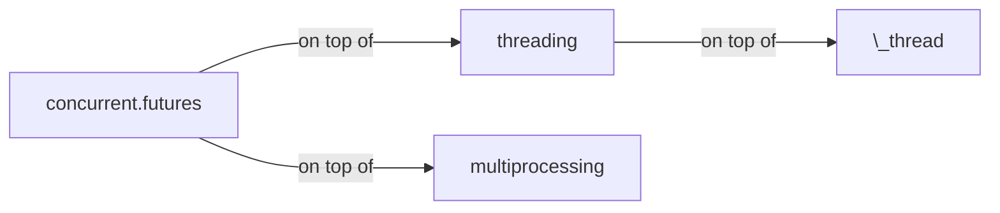
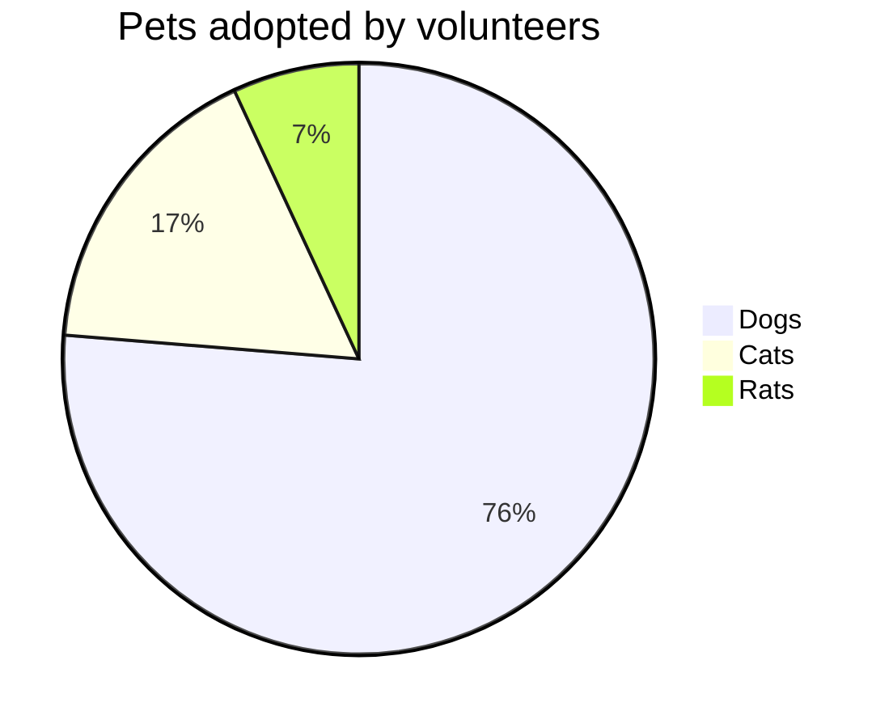
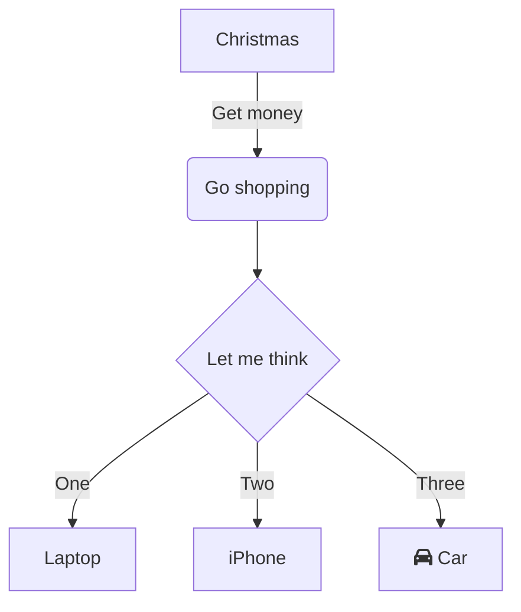
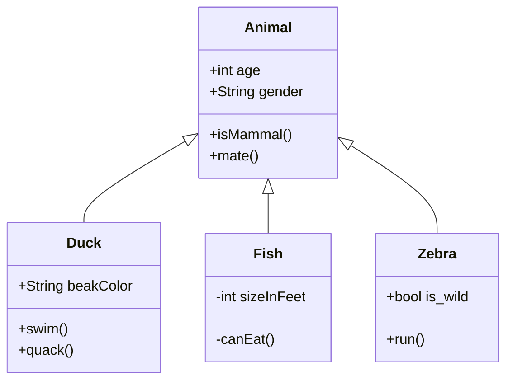
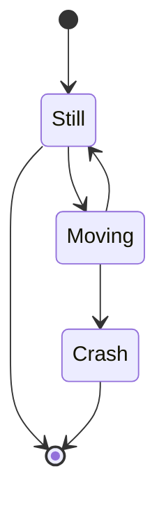

## An exhibit of Markdown

You can write regular [markdown](https://markdowntutorial.com/) here and Jekyll will automatically convert it to a nice webpage.  I strongly encourage you to [take 5 minutes to learn how to write in markdown](http://markdowntutorial.com/) - it'll teach you how to transform regular text into bold/italics/headings/tables/etc.

This note demonstrates some of what [Markdown][1] is capable of doing.

## Basic formatting

Paragraphs can be written like so. A paragraph is the basic block of Markdown. A paragraph is what text will turn into when there is no reason it should become anything else.

Paragraphs must be separated by a blank line. Basic formatting of *italics* and **bold** is supported. This *can be **nested** like* so.

`monospace`

## Lists

### Ordered list

1. Item 1
2. A second item
3. Number 3
4. Ⅳ

*Note: the fourth item uses the Unicode character for [Roman numeral four][2].*

### Unordered list

* An item
* Another item
* Yet another item
* And there's more...

## Paragraph modifiers

### Code block

    Code blocks are very useful for developers and other people who look at code or other things that are written in plain text. As you can see, it uses a fixed-width font.

You can also make `inline code` to add code into other things.

Here's a code sample:

    # Let me re-iterate ...
    for i in 1 .. 10 { do-something(i) }

As you probably guessed, indented 4 spaces. By the way, instead of
indenting the block, you can use delimited blocks, if you like:

~~~
define foobar() {
    print "Welcome to flavor country!";
}
~~~

(which makes copying & pasting easier). You can optionally mark the
delimited block for Pandoc to syntax highlight it:

~~~python
import time
# Quick, count to ten!
for i in range(10):
    # (but not *too* quick)
    time.sleep(0.5)
    print(i)
~~~

### Quote

> Here is a quote. What this is should be self explanatory. Quotes are automatically indented when they are used.

## Headings

There are six levels of headings. They correspond with the six levels of HTML headings. You've probably noticed them already in the page. Each level down uses one more hash character.

### Headings *can* also contain **formatting**

### They can even contain `inline code`

Of course, demonstrating what headings look like messes up the structure of the page.

I don't recommend using more than three or four levels of headings here, because, when you're smallest heading isn't too small, and you're largest heading isn't too big, and you want each size up to look noticeably larger and more important, there there are only so many sizes that you can use.

## URLs

URLs can be made in a handful of ways:

* A named link to [MarkItDown][3]. The easiest way to do these is to select what you want to make a link and hit `Ctrl+L`.
* Another named link to [MarkItDown](https://www.markitdown.net/)
* Sometimes you just want a URL like <https://www.markitdown.net/>.

## Horizontal rule

A horizontal rule is a line that goes across the middle of the page.

---

It's sometimes handy for breaking things up.

## Images

Markdown can also contain images. I'll need to add something here sometime.

## Finally

There's actually a lot more to Markdown than this. See the official [introduction][4] and [syntax][5] for more information. However, be aware that this is not using the official implementation, and this might work subtly differently in some of the little things.


  [1]: https://daringfireball.net/projects/markdown/
  [2]: https://www.fileformat.info/info/unicode/char/2163/index.htm
  [3]: https://www.markitdown.net/
  [4]: https://daringfireball.net/projects/markdown/basics
  [5]: https://daringfireball.net/projects/markdown/syntax


Note that --- not considering the asterisk --- the actual text
content starts at 4-columns in.

> Block quotes are
> written like so.
>
> They can span multiple paragraphs,
> if you like.

Use 3 dashes for an em-dash. Use 2 dashes for ranges (ex., "it's all
in chapters 12--14"). Three dots ... will be converted to an ellipsis.
Unicode is supported. ☺

Now a nested list:

 1. First, get these ingredients:

      * carrots
      * celery
      * lentils

 2. Boil some water.

 3. Dump everything in the pot and follow
    this algorithm:

        find wooden spoon
        uncover pot
        stir
        cover pot
        balance wooden spoon precariously on pot handle
        wait 10 minutes
        goto first step (or shut off burner when done)

    Do not bump wooden spoon or it will fall.

Notice again how text always lines up on 4-space indents (including
that last line which continues item 3 above).

Here's a link to [a website](http://foo.bar), to a [local
doc](local-doc.html), and to a [section heading in the current
doc](#an-h2-header). Here's a footnote [^1].

[^1]: Some footnote text.

Tables can look like this:

Name           Size  Material      Color
------------- -----  ------------  ------------
All Business      9  leather       brown
Roundabout       10  hemp canvas   natural
Cinderella       11  glass         transparent

Table: Shoes sizes, materials, and colors.

(The above is the caption for the table.) Pandoc also supports
multi-line tables:

--------  -----------------------
Keyword   Text
--------  -----------------------
red       Sunsets, apples, and
          other red or reddish
          things.

green     Leaves, grass, frogs
          and other things it's
          not easy being.
--------  -----------------------

A horizontal rule follows.

***

Here's a definition list:

apples
  : Good for making applesauce.

oranges
  : Citrus!

tomatoes
  : There's no "e" in tomatoe.

Again, text is indented 4 spaces. (Put a blank line between each
term and  its definition to spread things out more.)

Here's a "line block" (note how whitespace is honored):

| Line one
|   Line too
| Line tree

and images can be specified like so:


Inline math equation: $\omega = d\phi / dt$. Display
math should get its own line like so:

$$I = \int \rho R^{2} dV$$

And note that you can backslash-escape any punctuation characters
which you wish to be displayed literally, ex.: \`foo\`, \*bar\*, etc.

**Here is some bold text**

## Here is a secondary heading

Here's a useless table:

| Number | Next number | Previous number |
| :------ |:--- | :--- |
| Five | Six | Four |
| Ten | Eleven | Nine |
| Seven | Eight | Six |
| Two | Three | One |


How about a yummy crepe?


It can also be centered!

{: .center-block :}

Here's a code chunk:

~~~
var foo = function(x) {
  return(x + 5);
}
foo(3)
~~~

And here is the same code with syntax highlighting:

```javascript
var foo = function(x) {
  return(x + 5);
}
foo(3)
```

And here is the same code yet again but with line numbers:


var foo = function(x) {
  return(x + 5);
}
foo(3)


## Boxes
You can add notification, warning and error boxes like this:

### Notification

{: .box-note}
**Note:** This is a notification box.

### Warning

{: .box-warning}
**Warning:** This is a warning box.

### Error

{: .box-error}
**Error:** This is an error box.

### Math expressions

Put the math expression within <span>$</span>...\$:

\\(\LaTeX{}\\)

$\Pi$

$ a * b = c ^ b $

$ 2^{\frac{n-1}{3}} $

$ \int\_a^b f(x)\,dx. $

\\( \int\_a^b f(x)\,dx. \\)

$$
\begin{cases}
\text{if true}\ foo \\
\text{if false}\ bar
\end{cases}
$$

$ \rho {\rm{FOD}} = \sum\limits{\sigma ,i} {(\delta _1 - \delta _2 n_i^\sigma )|\phi _i^\sigma ({\bf{r}})|^2} $

$$ \rho {\rm{FOD}} = \sum\limits{\sigma ,i} {(\delta _1 - \delta _2 n_i^\sigma )|\phi _i^\sigma ({\bf{r}})|^2} $$


{{ "here is a liquid filter." | capitalize }}


\`escape inline code\`  
`inline code`  
Here is a **capture block**.


{{ test | markdownify }}

 
100 / 3 = {{ x }}

:+1:
:bolivia:

\1. 21312  
\2. 21312  
\4. 4214  


import networkx as nx
from collections import Counter

diagrams = defaultdict(list)
particle_counts = defaultdict(Counter)

for (a, b), neighbors in common_neighbors.items():
    # Build up the graph of connections between the
    # common neighbors of a and b.
    g = nx.Graph()
    for i in neighbors:
        for j in set(nl.point_indices[
            nl.query_point_indices == i]).intersection(neighbors):
            g.add_edge(i, j)

    # Define the identifiers for a CNA diagram:
    # The first integer is 1 if the particles are bonded, otherwise 2
    # The second integer is the number of shared neighbors
    # The third integer is the number of bonds among shared neighbors
    # The fourth integer is an index, just to ensure uniqueness of diagrams
    diagram_type = 2-int(b in nl.point_indices[nl.query_point_indices == a])
    key = (diagram_type, len(neighbors), g.number_of_edges())
    # If we've seen any neighborhood graphs with this signature,
    # we explicitly check if the two graphs are identical to
    # determine whether to save this one. Otherwise, we add
    # the new graph immediately.
    if key in diagrams:
        isomorphs = [nx.is_isomorphic(g, h) for h in diagrams[key]]
        if any(isomorphs):
            idx = isomorphs.index(True)
        else:
            diagrams[key].append(g)
            idx = diagrams[key].index(g)
    else:
        diagrams[key].append(g)
        idx = diagrams[key].index(g)
    cna_signature = key + (idx,)
    particle_counts[a].update([cna_signature])


```cpp
void insert(const char* key) {
    if (*key == '\0') {
        finish = true;
    } else {
        int idx = *key - 'A';
        if (!next[idx])
            next[idx] = new Trie();
        next[idx]->insert(key + 1);
    }
}
```

```ruby
p ":+1:"
```

``` diff
+        'user_exists' => 'SELECT EXISTS(SELECT 1 FROM table WHERE username = (:username || \'@sample'))',
+        'get_users' => 'SELECT split_part(username, \'@\', 1) FROM table WHERE (username ILIKE :search) OR (name ILIKE :search)',
+        'get_password_hash_for_user' => 'SELECT split_part(password, \'{CRYPT}\', 2) FROM table WHERE username = (:username || \'@sample\')',
+        'set_password_hash_for_user' => 'UPDATE table SET password =  \'{CRYPT}\' || :new_password_hash WHERE username = (:username || \'@sample\')',
```

Reload the Nginx:

``` console
$ sudo nginx -s reload
```

|:                        |:                  :|: $$O_3 + C_2H_2 \rightarrow $$         :|||:  $$O_3 + C_2H_4 \rightarrow $$ :|||:       :| 
|:  ^^ Method            :| ^^ $$\lambda^a$$  |    vdW |    TS |    cycloadd.           |  vdW  |  TS  |  cycloadd.           | ^^ MAE    |
|-------------------------|-------------------|--------|-------|------------------------|-------|------|----------------------|-----------|
| $$\lambda$$-tPBE        |   0.20            | -0.40  | 7.69  | -68.00                 | -1.86 | 4.87 | -57.57               | 1.29      |
|-------------------------|-------------------|--------|-------|------------------------|-------|------|----------------------|-----------|
| MC1H-PBE $$^b$$         |   0.25            | -1.08  | 3.66  | -70.97                 | -1.25 | 0.13 | -61.26               | 3.35      |
|-------------------------|-------------------|--------|-------|------------------------|-------|------|----------------------|-----------|
| Reference values $$^c$$ |   ---------       | -1.90  | 7.74  | -63.80                 | -1.94 | 3.37 | -57.15               | --------- |
|=========================|===================|========|=======|========================|=======|======|======================|===========|
| $$^a$$ The optimal mixing parameter.$$\~$$ $$^b$$ From Ref. .$$\~$$  $$^c$$ Best estimates from Ref. . ||||||||


|   1   |  2     |   3   |   4   |  5   |  6   |  7  |
| spancell1     ||   spancell2  || cell | spancell3 ||
|^^ spancell1   ||   spancell2  || cell | spancell3 ||
{:class="custom-table"}

<script>
|:-----:|:-----:|:-----:|:-----:|
| (0,0) | (0,1) | (0,2) | (0,3) |
|     (1,0)    || ^^    | (1,3) |
</script>


|:-----:|:-----:|:-----:|:-----:| ---- |
| (0,0) | (0,1) | (0,2) | (0,3) |      |
|     (1,0)    || ^^    | (1,3) |      |


|:-----:|:-----:|:-----:|:-----:| ---- |
| (0,0) | (0,1) | (0,2) | (0,3) |      |
|     (1,0)           ||| (1,3)       ||


|:-----:|:-----:|:-----:|:-----:| ---- |
| (0,0) | (0,1) | (0,2) | (0,3) |      |
|     (1,0)           ||| ^^    |      |

|:-----:|:-----:|:-----:|:-----:| ---- |
| (0,0) | (0,1) | (0,2) | (0,3) |      \
|     (1,0)           ||| ^^    |      |


## Table

| Stage | Direct Products | ATP Yields |
| ----: | --------------: | ---------: |
|Glycolysis | 2 ATP                   ||
|^^         | 2 NADH      | 3--5 ATP   |
|Pyruvaye oxidation | 2 NADH | 5 ATP   |
|Citric acid cycle  | 2 ATP           ||
|^^                 | 6 NADH | 15 ATP  |
|^^                 | 2 FADH | 3 ATP   |
|                        30--32 ATP  |||


{:color-style: style="background: black;" }
{:color-style: style="color: white;" }
{:font-style: style="font-weight: 900; text-decoration: underline;" }

|:             Here's a Inline Attribute Lists example                 :||||
| ------- | ------------------------- | -------------------- | ----------- |
|:       :|:  <div style="color: red;"> &lt; Normal HTML Block > </div> :|||
| ^^      |   Red    {: .cls style="background: orange" }                |||
| ^^ IALs |   Green  {: #id style="background: green; color: white" }    |||
| ^^      |   Blue   {: style="background: blue; color: white" }         |||
| ^^      |   Black  {: color-style font-style}                          |||


[cell image]: https://jekyllrb.com/img/octojekyll.png "An exemplary image"

| Heading            | Column 1      | Column 2                           |
|--------------------|---------------|------------------------------------|
| Row 1              | Apple[^1]     | [Youtube (Home)]                   |
| Row 2              | Banana        | [Github][1]                        |
| Row 3 (merged)     | Blueberry     | [Google] *****  [Github]           |
| ^^         | [Plum](https://example.com) | Raspberry ![example][cell image]   |
| Row 4      | <https://www.google.com>    |  [test](https://www.google.com){:target="_blank"}                            |
|^^          |^^ <https://www.youtube.com> |                              |
| Row 5      | <https://www.google.com>                                  ||

[Youtube (Home)]: https://www.youtube.com
[Google]: https://www.google.com
[Github]: https://www.github.com
[1]: https://www.github.com
[^1]: Footnote

<https://www.google.com>

Not in table: `<Mail Gateway>`

In table:

Decision Point | Design Decision
--- | ---
Authoritative DNS MX Record | `<Mail Gateway>`

9 \* 9

| 1 \* 1 = 1 |
| 1 \* 2 = 2 | 2 \* 2 = 4 |
| 1 \* 3 = 3 | 2 \* 3 = 6 | 3 \* 3 = 9  |
| 1 \* 3 = 3 | 2 \* 3 = 6 | 3 \* 4 = 12 | 4 \* 4 = 16 |

## Emoji
:+1:

## Mathjax

$\LaTeX{}$

## PlantUML

@startuml
Bob -> Alice : hello
@enduml

## Mermaid



## Video


[\[video link\]](//www.youtube.com/watch?v=Ptk_1Dc2iPY)

## Audio

[HTML5 Audio Formats Test](https://hpr.dogphilosophy.net/test/)

Opus Audio (".opus"):


"MP3" file (".mp3") :


WebM Audio (".weba"):


WebMv2 Audio (".webm"):


Ogg Vorbis (".ogg") :


"wave" file(".wav") :


FLAC file (".flac") :


CAF file (".caf") :


Spotify Podcast:


## Special media links


[](https://www.youtube.com/watch?v=kCHGDRHZ4eU)

Tips:
* Use pipes (`|`) to delineate columns, and dashes to delineate the header row from the rest of the table.
* Spacing doesn't matter to the markdown processor, any extra white space is removed, but it can really help with readability.
The two markdown examples below both create this table.

Use pipes `(`|`)` to delineate columns, and dashes to delineate the header row from the rest of the table.

## Mermaid Diagrams

### 1. Pie chart



### 2. sequence diagram

@startmermaid
sequenceDiagram
  Alice ->> Bob: Hello Bob, how are you?
  Bob-->>John: How about you John?
  Bob--x Alice: I am good thanks!
  Bob-x John: I am good thanks!
  Note right of John: Bob thinks a long<br/>long time, so long<br/>that the text does<br/>not fit on a row.
  
  Bob-->Alice: Checking with John...
  Alice->John: Yes... John, how are you?
@endmermaid



### 3. Class diagram


### 4. State diagram


## PlantUML

### PlantUML Block-1
@startuml
Bob -> Alice : hello
@enduml


### PlantUML Block-2
``` plantuml!
Bob -> Alice : hello world
```


### PlantUML Block-3
@startuml
(*) --> "Initialization"

if "Some Test" then
  -->[true] "Some Activity"
  --> "Another activity"
  -right-> (*)
else
  ->[false] "Something else"
  -->[Ending process] (*)
endif
@enduml


### PlantUML Block-4

@startuml
skinparam handwritten true

skinparam usecase {
  BackgroundColor DarkSeaGreen
  BorderColor DarkSlateGray

  BackgroundColor<< Main >> YellowGreen
  BorderColor<< Main >> YellowGreen

  ArrowColor Olive
  ActorBorderColor black
  ActorFontName Courier

  ActorBackgroundColor<< Human >> Gold
}

User << Human >>
:Main Database: as MySql << Application >>
(Start) << One Shot >>
(Use the application) as (Use) << Main >>

User -> (Start)
User --> (Use)

MySql --> (Use)

@enduml

## Video Examples

### Canon in D (Pachelbel's Canon) - Cello & Piano [BEST WEDDING VERSION]
Some of you know that we occasionally play for weddings. As you can imagine, we get a LOT of requests for Canon in D, and we discovered that there were no good arrangements available anywhere for piano and cello! Hard to believe given its popularity. So we decided to make our own! We tried to stick as closely to the original as possible (which was written for three violins and basso continuo), and we performed it *not* at a snail's pace so the bride can actually make it down the aisle without putting everyone to sleep. 🙊(Yeah, we said it! Nobody likes a slow processional!) Also, the number one complaint about this piece from cellists is always how booooring it is to play because they literally have to play the same 8 bass notes over and over for the entire piece. Problem solved with this arrangement because the cello never has to play the bass! 🙌(The piano does, but we get lots of other fun stuff too so it's ok!) So for all you musicians out there playing weddings, we hope you enjoy playing this arrangement a little more than the ones you were used to...You can get it from www.musicnotes.com. 😊Be sure to let us know in the comments if you do!


### GUCCI HALLUCINATION / THE LINE ANIMATION / GUCCI
BACKGROUND /

Gucci share their creative vision through a series of surreal animated paintings by acclaimed artist Ignasi Monreal and The Line Animation studio. The animations make up part of a larger campaign shared via social media, above the line and print.

APPROACH /

Our aim was to ground and accentuate the outlandish scenarios with ambient sound design. Neither proclaiming to be positive or negative, the sound conveys a sense of the uncanny and leaves the audience with nothing but their own interpretations. their creative vision through a series of surreal animated paintings by acclaimed artist Ignasi Monreal and The Line Animation studio. The animations make up part of a larger campaign shared via social media, above the line and print.


### FINNEAS Demos How He Builds Songs For Billie Eilish
Grammy Award-winning musician and producer FINNEAS sits down with Pitchfork and closely examines his creative process while working on some of the biggest hit songs of the past couple years. FINNEAS explores the sounds that brought upon 
some of his greatest musical breakthroughs in songs such as bad guy, bury a friend, ocean eyes, when the party's over, I Lost a Friend, Used to This and much more.

![][demo]  

[demo]: https://dai.ly/x7tgcev

### 2019 BMW Vision M NEXT Concept (HD)

In future, drivers will be able to choose whether they wish to be driven or do the driving themselves. With the BMW Vision M NEXT, the BMW Group is revealing its take on how driving pleasure might look in future. It offers a foretaste of the BMW M brand’s electrified future by placing the focus squarely on the actively engaged driver. Intelligent technologies provide comprehensive yet carefully targeted assistance to turn them into the ultimate driver.

  

### This is the poster image
In modern browsers, adding a video to your page is as easy as adding an image. No longer do you need to deal with special plug-ins or require crazy markup, you can do it with a single element.


## Table examples

**For now, these extended features are provided:**

* Cells spanning multiple columns
* Cells spanning multiple rows
* Cells text align separately
* Table header not required
* Grouped table header rows or data rows

### Rowspan and Colspan
^^ in a cell indicates it should be merged with the cell above.  
This feature is contributed by [pmccloghrylaing](https://github.com/pmccloghrylaing).  

| Stage | Direct Products | ATP Yields |
| ----: | --------------: | ---------: |
|Glycolysis | 2 ATP                   ||
|^^         | 2 NADH      | 3--5 ATP   |
|Pyruvaye oxidation | 2 NADH | 5 ATP   |
|Citric acid cycle  | 2 ATP           ||
|^^                 | 6 NADH | 15 ATP  |
|^^                 | 2 FADH | 3 ATP   |
| 30--32 ATP                         |||

[ Net ATP yields per hexose]

### Multiline
A backslash at end to join cell contents with the following lines.  
This feature is contributed by [Lucas-C](https://github.com/Lucas-C).

|:     Easy Multiline     :|||
|:------ |:------ |:-------- |
| Apple  | Banana |  Orange  \
| Apple  | Banana |  Orange  \
| Apple  | Banana |  Orange
| Apple  | Banana |  Orange  \
| Apple  | Banana |  Orange  |
| Apple  | Banana |  Orange  |


### Headerless
Table header can be eliminated.

|--|--|--|--|--|--|--|--|
|♜ |  |♝ |♛ |♚ |♝ |♞ |♜ |
|  |♟ |♟ |♟ |  |♟ |♟ |♟ |
|♟ |  |♞ |  |  |  |  |  |
|  |♗ |  |  |♟ |  |  |  |
|  |  |  |  |♙ |  |  |  |
|  |  |  |  |  |♘ |  |  |
|♙ |♙ |♙ |♙ |  |♙ |♙ |♙ |
|♖ |♘ |♗ |♕ |♔ |  |  |♖ |


```markdown
|:     Fruits \|\| Food           :|||
|:-------- |:-------- |:------------ |
| Apple    |: Apple  :|    Apple     \
| Banana   |  Banana  |    Banana    \
| Orange   |  Orange  |    Orange    |
|:   Rowspan is 5   :||:  How's it? :|
|^^   A. Peach       ||^^ 1. Fine    |
|^^   B. Orange      ||^^ 2. Bad  $I = \int \rho R^{2} dV$     |
|^^   C. Banana      ||   It's OK! ![example image][my-image]  |
```

### Text Alignment
Table cell can be set alignment separately.

| \:Fruits         ||  Food   :|
|:-------- |:------ |:-------- |
| Apple    | Banana |  Orange  |
| Apple    | Banana |  Orange  |


|          | Fruits\::        ||
|:-------- |:------ |:-------- |
| Apple    | Banana |  Orange  |
| Apple    | Banana |  Orange  |


|: \:Fruits       :||          |:       Food     :||
|:-------- |:------ |:-------- |:-------- |:------ |
| Apple    | Banana |  Orange  |:   Strawberry    :|
| Apple  &  Banana || ^^       |    Peach        :||


|: \:Fruits       :||          |:       Food     :||
| Apple    | Banana |  Orange  |:   Strawberry    :|


|:     Fruits \|\| Food           :|||
|:-------- |:-------- |:------------ |
| Apple    |: Apple  :|    Apple     \
| Banana   |  Banana  |    Banana    \
| Orange   |  Orange  |    Orange    |
|:   Rowspan is 5   :||:  How's it? :|
|^^   A. Peach       ||^^ 1. Fine    |
|^^   B. Orange      ||^^ 2. Bad  $I = \int \rho R^{2} dV$     |
|^^   C. Banana      ||   It's OK! ![example image][my-image]  |

[my-image]: http://www.unexpected-vortices.com/sw/rippledoc/example-image.jpg "An exemplary image"

